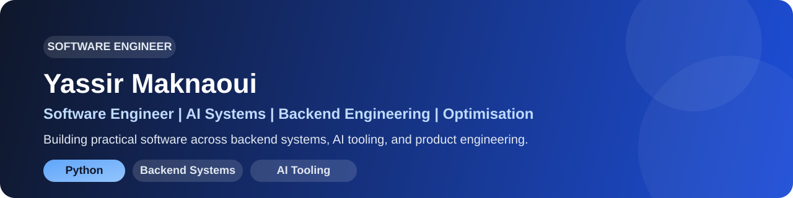

  

  
  
  

Software engineer focused on AI systems, backend platforms, and optimisation. I graduated with First-Class Honours in Computer Science and Mathematics from Royal Holloway, University of London, and I build software that is practical, performant, and production-ready.

My work sits at the intersection of backend engineering, intelligent systems, and applied research. I care about clean architecture, operational reliability, and turning complex technical ideas into useful products.

## About Me
- I build backend services, APIs, and data-driven systems with Python, SQL, and modern web infrastructure.
- I work on AI systems involving embeddings, RAG workflows, and LLM-oriented tooling.
- I enjoy optimisation-heavy problems, especially scheduling, constrained systems, and performance-focused engineering.
- I have shipped production-facing web and mobile features across commercial and research environments.

## Featured Projects
- [opensre](https://github.com/yas789/opensre) - Open source AI SRE toolkit for operational agents and automation workflows.
- [adaptive](https://github.com/yas789/adaptive) - LLM inference infrastructure focused on efficient model selection and cost optimisation.
- [wsp-backtracker](https://github.com/yas789/wsp-backtracker) - Fixed-parameter solver for workflow satisfiability and secure scheduling problems.
- [IncidentApp](https://github.com/yas789/IncidentApp) - Incident management application with operational workflows and user-facing functionality.

## Experience Snapshot
- Delivered paid frontend and mobile work across multiple commercial products, shipping customer-facing flows for ordering, booking, admin, and operations.
- Built modular Python research pipelines for quantum ML and systems experiments, improving reproducibility and reducing runtime through workflow automation.
- Developed OCR and LLM-assisted tooling for historical mathematical text analysis in academic research settings.

## Tech Stack

`Python` `Java` `C#` `SQL` `Bash` `FastAPI` `Flask` `PostgreSQL` `Docker` `GitHub Actions` `PyTorch` `Hugging Face` `React` `React Native`

## Current Interests
- Backend engineering
- AI infrastructure
- Optimisation and solver-based systems
- Product-focused software roles with strong systems ownership
